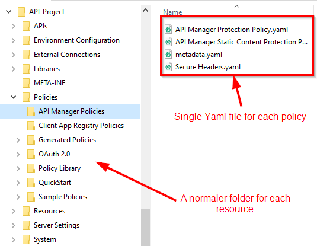

[](https://github.com/axwayhackathon/YamlES/actions)

# YAML Entity Store

The Policy Configuration Set (called FED), as used today by the Axway API Gateway and modified by Policy Studio, is based on a set of very large XML files.
These XML files cannot be modified outside of Policy Studio. Therefore it is not possible to validate, approve and finally merge changes into the Master-Branch. Lean how the [GitFlow](https://blog.axosoft.com/pull-requests-gitflow/) works and is used by larger teams to maintain/control software changes.  

## Entity Store
The Entity Store is the interface for any component of Axway API management to read and write the policy configuration set. This means that the API gateway, Policy Studio, Node-Management and each phyton script does not access the XML files directly, instead using a clearly defined interface. 

### Example usage of the Entity-Store
A good example in one of the Pyhton scripts:
```python
from com.vordel.es import EntityStore 
# Gets the component entity store from the archive based on store type
componentEntityStores = archive.getComponentEntityStores(outputDir)
es = EntityStoreAPI.wrap(componentEntityStores.get(options.storeType), "")

# Check to see if it has the custom type registered 
if es.hasType(options.typeName):
    # Export the store as a byte array 
    pks = []
    pks.append(es.es.getRootPK())
```

## What is the Yaml Entity-Store?
Since the Entity Store is an interface with an implementation that is currently based on XML files, it can be replaced. 
This project has the goal to replace the XML file based entity store with a Yaml file based implementation. Of course not to create a series of large yaml files, but the following structure:  
  
Each policy is now managed in an human readable Yaml file. For the instance the well know Health-Check policy:  
```yaml
---
meta:
  type: "FilterCircuit"
  _version: "4"
fields:
  name: "Health Check"
  start: "Set Message"
logging:
  category: "System/Policy Categories/miscellaneous"
children:
  Reflect:
    meta:
      type: "Reflector"
      _version: "0"
    fields:
      name: "Reflect"
    logging:
      logFatal: "Error occurred while echoing the message. Error: ${circuit.exception}"
      logFailure: "Failed to echo back the message"
      logSuccess: "Successfully echoed back the message"
      category: "System/Filter Categories/miscellaneous"
  Set Message:
    meta:
      type: "ChangeMessageFilter"
      _version: "0"
    fields:
      body: "<status>ok</status>"
      name: "Set Message"
      outputContentType: "text/xml"
    routing:
      successNode: "Policies/Policy Library/Health Check/Reflect"
    logging:
      logFatal: "Error in setting the message. Error: ${circuit.exception}"
      logFailure: "Failed in setting the message"
      logSuccess: "Success in setting the message"
      category: "System/Filter Categories/miscellaneous"

```
With that, changes to policies, Javascript-Code, etc. becomes Human-Readable and can be managed using Pull-Requests, etc.  
The ultimate goal:
- Allow all components to read and write using the Yaml-Entitystore
  - this includes Policy-Studio to work on the Yaml-Entity store
- Using native appropriate file-types. e.g. Python-Script --> scriptA.py, etc.

## Build
To build a local package please execute:  
```java
    mvn package
```

## Test

### Unit tests

* [ ] ToDo

### Integration tests 
Integration tests are automatically executed as part of the CI pipeline. You can run them manually with the following command:
  
```java
    mvn verify
```

## Using the Converter
After you have built your local package you can use it to convert the between the Entity-Store versions with the following commands. 

### Convert .fed to yaml

```java
    java -cp YamlES-0.0.1-SNAPSHOT-jar-with-dependencies.jar com.axway.gw.es.tools.ConvertToYamlStore federated:file:<fed_file_directory>/configs.xml <yaml_output_directory>
```
Please note: On Windows you must use: `federated:file:///C:/...`

### Merge yaml to .fed

```java
    java -cp YamlES-0.0.1-SNAPSHOT-jar-with-dependencies.jar com.axway.gw.es.tools.CloneES federated:file:<fed_file_directory>/configs.xml <yaml_output_directory>
```
